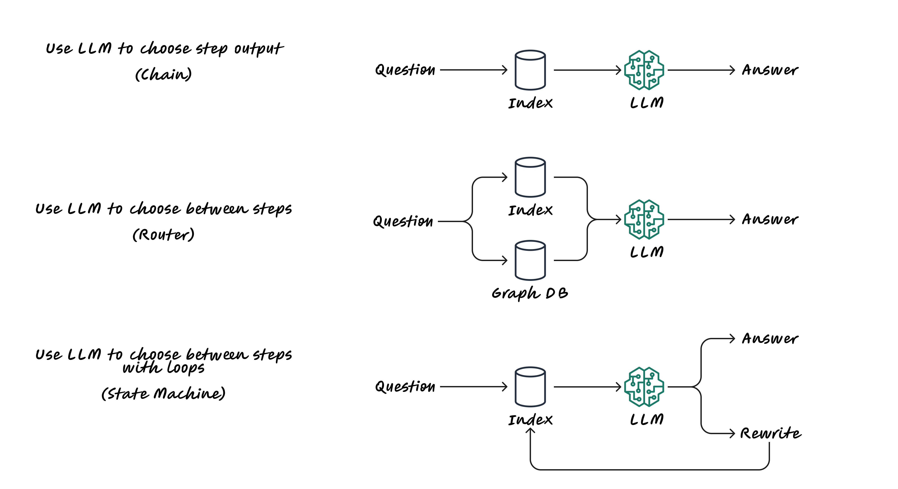
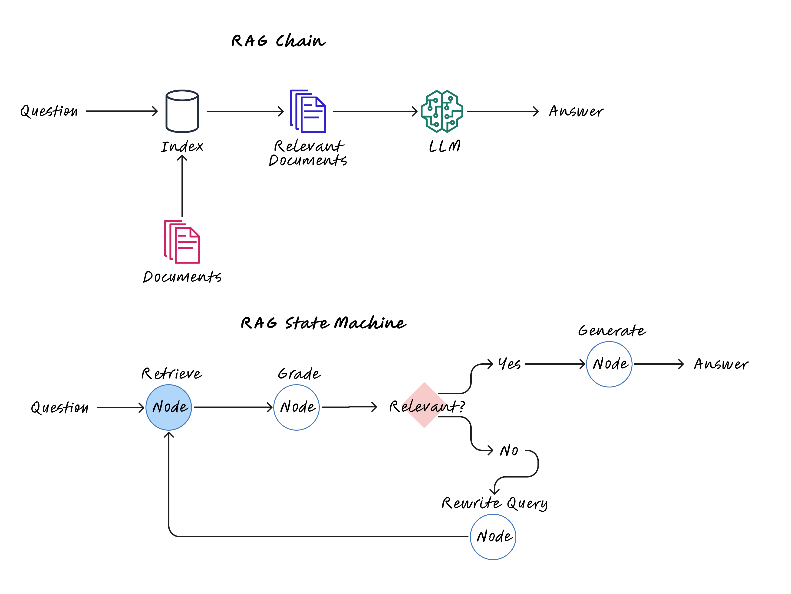
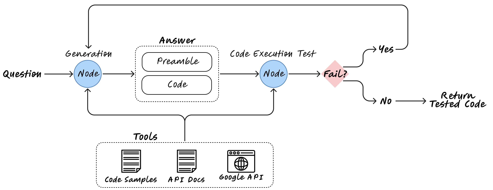

# AI Junior Cloud Engineer - Challenge


## Cognitive architectures for RAG



## State machines let us design more complex RAG "flows"



## Overview

This solution represents a significant leap forward in deploying infrastructure and applications to the cloud efficiently. Designed for AWS, it leverages the AWS Cloud Development Kit (CDK) to generate infrastructure as code, enabling both experienced engineers and juniors to deploy complex cloud architectures with ease. Our tool is capable of interpreting tasks from both textual instructions and architectural diagrams, making it a versatile assistant for cloud deployments.

## Langgraph Architecture



## Key Features

- Text and Diagram Inputs: Accepts detailed deployment tasks as text prompts or through architectural diagrams, offering flexibility in how deployment tasks are specified.
- Error Handling and Iteration: Capable of capturing and responding to errors by regenerating solutions with error feedback, improving the deployment process iteratively.
- Infrastructure as Code: Generates AWS CDK code to deploy infrastructure, including web servers on Amazon Linux instances, VPC configurations, encrypted EBS volumes, and more.

## Installation

To install the AI Junior Cloud Engineer tool, follow these steps:

1. Clone the repository to your local machine.
2. Install the required dependencies using `pip install -r requirements.txt`.
3. Run the AI Agent using `python agent.py`.

## Usage

To use the AI Junior Cloud Engineer API, send a POST request to the `/codelangchain/stream`:

```python
import requests

response = requests.post(
    "http://localhost:8000/codelangchain/stream",
    json={
        "input": "Create VPC with 2 Public subnets",
        "config": {},
        "kwargs": {}
    }
)
print(response)
```

## Streamlit

#### Prerequisites:
- Setup AWS credentials in your local machine.
- Enable 'anthropic.claude-3-sonnet-20240229-v1:0' model in Amazon Bedrock.

#### Running the Streamlit App:
The Streamlit app is a user-friendly interface for interacting with the AI Junior Cloud Engineer tool. It allows users to input deployment tasks and view the generated AWS CDK code.

To run the Streamlit app, use the following command:

```bash
streamlit run app/app.py
```


## License
MIT License